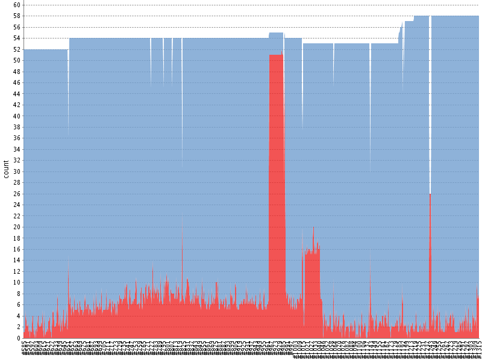

!SLIDE bullets incremental
# Our stack

* [watir-webdriver](https://github.com/jarib/watir-webdriver)
* [Jenkins](http://jenkins-ci.org/)
* [Xvfb](http://www.x.org/archive/X11R6.8.1/doc/Xvfb.1.html)

!SLIDE
# watir-webdriver

    @@@ ruby
    @browser.goto('jimdo.com')
    @browser.div(:id, 'header')
            .ul(:class, 'nav').links

!SLIDE center
# Jenkins

!SLIDE
# Lessons Learned

!SLIDE
# It's all about timing

!SLIDE center 

    @@@ ruby
    timed out after 30 seconds
    (Watir::Wait::TimeoutError)

!SLIDE center smaller

    @@@ ruby
    Element is no longer attached to the DOM
    (Selenium::WebDriver::Error::ObsoleteElementError)

!SLIDE bullets incremental
# No broken windows!

* Establish a culture sensitive to those brittle tests
* Fix them at once, dig down to the problem
* Needs discipline
* Otherwise all is in vain

!SLIDE bullets incremental
# Pick your own stack

* Go with what fits you
* Don't try to force Rails specific solution
* Keep it simple

!SLIDE bullets incremental
# Ruby in a PHP company?

* Works great.
* Fully embraced by team
* Yippieh, I actually get to work with some _awesome_ technology
* Diversity opens up room for improvement
